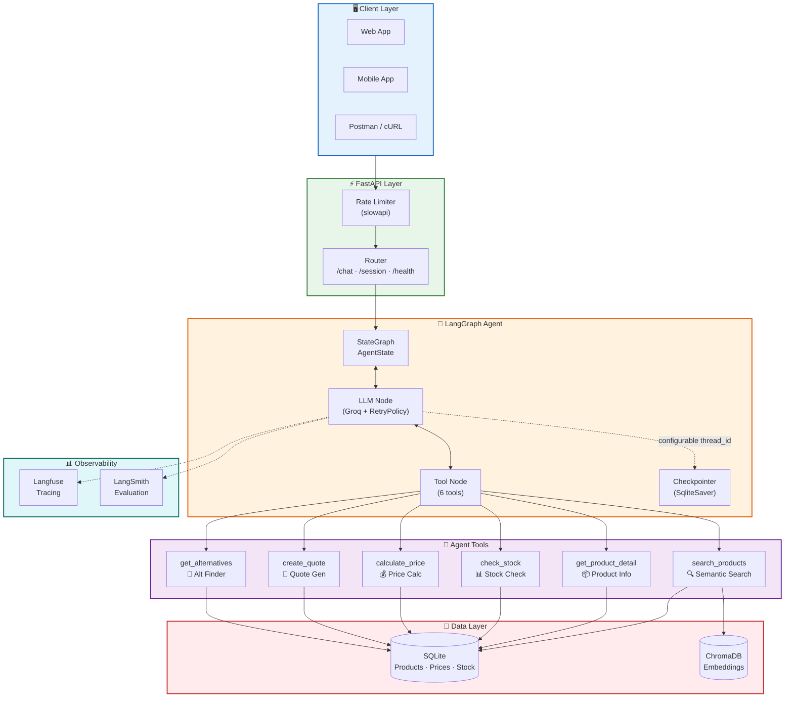
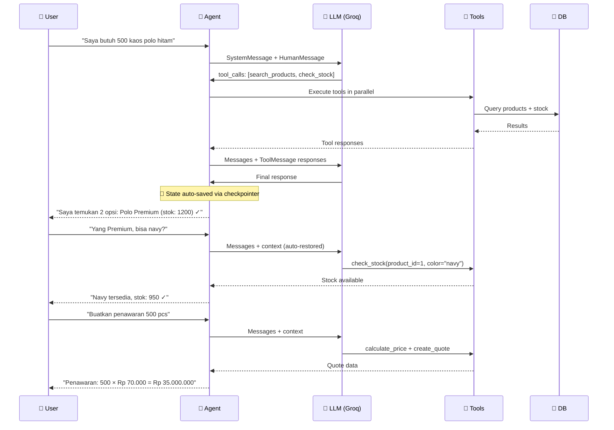
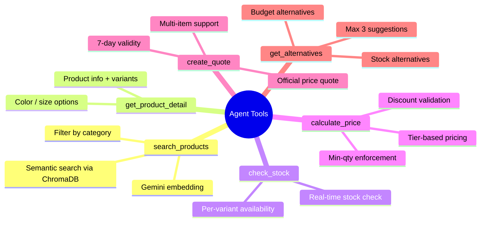

<div align="center">

# 🛍️ Sales Order Agent — PT Lemone Surya Indonesia

### AI-Powered B2B Fashion Wholesale Ordering System


**Multi-turn conversational AI agent** yang membantu proses order fashion grosir B2B — dari pencarian produk, pengecekan stok, kalkulasi harga, hingga pembuatan penawaran resmi.

---

</div>

## 📐 Architecture

### System Architecture



### Agent Flow (ReAct Pattern)



---

## 🚀 Tech Stack

| Layer | Technology | Purpose |
|-------|-----------|---------|
| **Agent Framework** | LangGraph | Stateful multi-turn agent with ReAct pattern |
| **LLM** | Groq (Llama 3.3 70B) | Ultra-fast inference (~100ms) |
| **Embedding** | Google Gemini (gemini-embedding-001) | Semantic product search |
| **Backend** | FastAPI + Uvicorn | Async API server |
| **Database** | SQLite + DB Indexes | Structured data storage |
| **Vector DB** | ChromaDB | Semantic search embeddings |
| **State Persistence** | LangGraph Checkpointer (SqliteSaver) | Automatic conversation state |
| **Observability** | Langfuse | Agent tracing & monitoring |
| **Rate Limiting** | Slowapi | API abuse prevention |
| **Caching** | cachetools (TTLCache) | Static data caching |

---

## ✨ Key Features

### 🤖 AI Agent Capabilities
- **Multi-turn conversation** — Agent ingat konteks percakapan sebelumnya
- **6 specialized tools** — Product search, stock check, price calc, quote gen, alternatives
- **ReAct reasoning** — Agent berpikir sebelum bertindak (think → act → observe)
- **Retry policy** — Auto-retry 3x pada transient failures

### 🏗️ Architecture Highlights
- **LangGraph Checkpointer** — State otomatis di-persist, support time-travel debugging
- **SystemMessage** — System prompt terisolasi dari user input (security best practice)
- **Async wrapping** — DB calls via `asyncio.to_thread()` untuk non-blocking
- **TTL caching** — Static data di-cache 5-10 menit
- **Configurable CORS** — Environment-based origin restriction

### 📊 Production Ready
- **168+ unit tests** — Tools, database, API, agent, HITL E2E, evaluation pipeline
- **25 eval test cases** — Automated accuracy testing with golden dataset
- **Rate limiting** — 10 requests/minute per IP
- **Global error handling** — Consistent error response format
- **Health checks** — DB, ChromaDB, Groq, Langfuse status
- **Structured logging** — Request ID tracking

---

## 🛠️ Agent Tools



---

## 📡 API Endpoints

| Method | Endpoint | Description | Request Body |
|--------|----------|-------------|-------------|
| `GET` | `/health` | System health check | — |
| `POST` | `/session` | Create new session | `{ "customer_name": "..." }` |
| `GET` | `/session/{id}` | Get session info | — |
| `POST` | `/chat` | Send message to agent | `{ "message": "...", "session_id": "..." }` |

### Example Request

```bash
# Start conversation
curl -X POST http://localhost:8000/chat \
  -H "Content-Type: application/json" \
  -d '{"message": "Saya butuh 500 kaos polo hitam untuk seragam"}'

# Continue conversation (with session_id)
curl -X POST http://localhost:8000/chat \
  -H "Content-Type: application/json" \
  -d '{"message": "Buatkan penawaran", "session_id": "abc-123"}'
```

---

## 💬 Example Conversation

```
👤 User: Saya butuh 500 kaos polo hitam untuk seragam karyawan

🤖 Agent: Saya temukan 2 opsi untuk kaos polo hitam:
   1. Polo Premium Cotton — stok: 1,200 pcs ✓
   2. Polo Basic — stok: 800 pcs ✓
   
   Mau saya buatkan penawaran untuk yang mana?

👤 User: Yang Premium. Tapi bisa warna navy?

🤖 Agent: Polo Premium tersedia dalam warna:
   - Hitam (stok: 1,200) ✓
   - Navy (stok: 950) ✓
   
   Untuk 500 pcs navy, stok aman. Mau lanjut?

👤 User: Oke, buatkan penawaran 500 pcs navy

🤖 Agent: Penawaran Q-2026-09-02:
   ┌─────────────────────────────────────┐
   │ 500 × Polo Premium Navy            │
   │ @ Rp 70.000/pcs                    │
   │ Subtotal: Rp 35.000.000            │
   │ Berlaku: 7 hari                    │
   └─────────────────────────────────────┘
```

---

## 🧪 Testing & Evaluation

### Unit Tests

```bash
# Run all unit tests (168+ tests)
pytest tests/ -v --ignore=tests/test_integration.py

# Run specific test suites
pytest tests/test_tools.py -v          # 52 tool tests
pytest tests/test_database.py -v       # 10 DB tests
pytest tests/test_api.py -v            # 9 API tests
pytest tests/test_agent.py -v          # 9 agent tests
pytest tests/test_hitl_e2e.py -v       # 34 HITL E2E tests
pytest tests/test_integration.py -v    # 3 integration tests (mocked LLM)
```

### Evaluation Pipeline

Automated eval dengan **25 golden test cases** yang mengukur akurasi tool layer:

```bash
# Run eval pipeline (25 test cases)
pytest tests/test_eval_pipeline.py -v

# Run specific category
pytest tests/test_eval_pipeline.py -v -k "product_search"
pytest tests/test_eval_pipeline.py -v -k "pricing"
pytest tests/test_eval_pipeline.py -v -k "stock_check"
pytest tests/test_eval_pipeline.py -v -k "failure_mode"
```

#### Eval Results

| Category | Tests | Passed | Accuracy | Avg Latency |
|----------|-------|--------|----------|-------------|
| Product Search | 5 | 5 | **100%** | 580ms |
| Pricing (Tier-based) | 5 | 5 | **100%** | <1ms |
| Stock Check | 5 | 5 | **100%** | <1ms |
| Combined Queries | 5 | 5 | **100%** | 200ms |
| Failure Modes | 5 | 5 | **100%** | <1ms |
| **Overall** | **25** | **25** | **100%** | **<200ms** |

#### Eval Design

```mermaid
graph LR
    subgraph Golden["📋 Golden Dataset"]
        G1["15 Real Cases<br/>(from seed data)"]
        G2["10 Edge Cases<br/>(failure modes)"]
    end

    subgraph Tools["🔧 Tool Layer"]
        T1["search_products"]
        T2["calculate_price"]
        T3["check_stock"]
    end

    subgraph Assert["✅ Assertions"]
        A1["Product ID Match"]
        A2["Price Tier Match"]
        A3["Stock Availability"]
        A4["Keyword Presence"]
        A5["Forbidden Keywords"]
    end

    subgraph Report["📊 Report"]
        R1["Accuracy %"]
        R2["Latency p50"]
        R3["Pass/Fail"]
    end

    Golden --> Tools --> Assert --> Report

    style Golden fill:#E8F5E9,stroke:#2E7D32
    style Tools fill:#FFF3E0,stroke:#E65100
    style Assert fill:#E3F2FD,stroke:#1565C0
    style Report fill:#F3E5F5,stroke:#6A1B9A
```



### Test Coverage

| Module | Tests | Status |
|--------|-------|--------|
| Tools | 52 | ✅ All passing |
| Eval Pipeline | 25 | ✅ 100% accuracy |
| HITL E2E | 34 | ✅ All passing |
| Database | 10 | ✅ All passing |
| API | 9 | ✅ All passing |
| Agent | 9 | ✅ All passing |
| Integration | 3 | ✅ All passing |

---

## 📁 Project Structure

```
src/
├── main.py                    # FastAPI entry point + lifespan
├── agents/                    # 🤖 LangGraph Agent
│   ├── graph.py              #   State graph + conditional edges
│   ├── state.py              #   AgentState (TypedDict)
│   ├── nodes.py              #   LLM node + Tool node
│   └── prompts.py            #   System prompt
├── tools/                     # 🔧 6 Agent Tools
│   ├── search_products.py    #   Semantic search
│   ├── get_product_detail.py #   Product info
│   ├── check_stock.py        #   Stock check
│   ├── calculate_price.py    #   Price calc + tier
│   ├── create_quote.py       #   Quote generation
│   └── get_alternatives.py   #   Alternative finder
├── api/                       # ⚡ FastAPI Routes
│   ├── chat.py               #   POST /chat
│   ├── session.py            #   POST /session
│   ├── health.py             #   GET /health
│   └── models.py             #   Pydantic models
├── data/                      # 💾 Data Layer
│   ├── database.py           #   SQLite + caching
│   ├── vector_store.py       #   ChromaDB embeddings
│   └── seed/                 #   Synthetic data seeder
└── config/                    # ⚙️ Configuration
    ├── settings.py           #   Pydantic Settings
    └── langfuse.py           #   Langfuse integration

tests/
├── test_tools.py             # 52 tool tests
├── test_eval_pipeline.py     # 25 eval pipeline tests ← NEW
├── golden_dataset.json       # 25 golden test cases ← NEW
├── test_hitl_e2e.py          # 34 HITL E2E tests
├── test_database.py          # 10 DB tests
├── test_database_extended.py # 8 extended DB tests
├── test_api.py               # 9 API tests
├── test_agent.py             # 9 agent tests
├── test_integration.py       # 3 integration tests
└── conftest.py               # Shared fixtures
```

---

## ⚡ Quick Start

### Prerequisites

- Python 3.13+
- [Groq API Key](https://console.groq.com/) (free tier available)
- [Google API Key](https://aistudio.google.com/) (for Gemini Embedding)

### Installation

```bash
# Clone
git clone https://github.com/jelicodes/sales-order-agent.git
cd sales-order-agent

# Install dependencies
pip install -r requirements.txt

# Configure
cp .env.example .env
# Edit .env with your API keys

# Seed database (12 products, 40+ price tiers, 5 discounts)
python -m src.data.seed.seed

# Run server
python -m src.main
```

Server runs at `http://localhost:8000`

📖 **API Docs:** `http://localhost:8000/docs` (Swagger UI)

---

## 📈 Performance

| Metric | Value |
|--------|-------|
| LLM Inference | ~100ms (Groq) |
| DB Query (cached) | <1ms |
| DB Query (cold) | ~5ms |
| API Response (cached) | <200ms |
| API Response (LLM) | 1-3s |
| **Eval Pipeline (25 cases)** | **<10s total** |
| **Tool Accuracy (eval)** | **100%** |

---

## 📜 License

MIT License — see [LICENSE](LICENSE) for details.

---

<div align="center">

**Built with ❤️ for PT Lemone Surya Indonesia**

*Demonstrating AI Agent architecture, LangGraph state management, and production-ready FastAPI backend*

</div>
